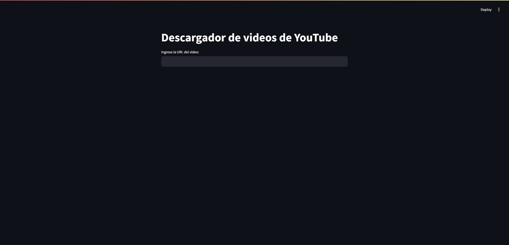

# YouTube Video Downloader



Una aplicación de Streamlit para descargar videos de YouTube utilizando `yt-dlp`.

## Características

- Descarga videos de YouTube con opciones de calidad de video y audio.
- Combina automáticamente audio y video si es necesario.
- Interfaz fácil de usar construida con Streamlit.

## Requisitos

- Python 3.6+
- `yt-dlp`
- `streamlit`

## Instalación

1. Clona este repositorio:

    ```bash
    git clone https://github.com/jgmdevelopers/youtube-video-downloader.git
    cd youtube-video-downloader
    ```

2. Crea un entorno virtual y actívalo:

    En Windows:
    ```bash
    python -m venv venv
    .\venv\Scripts\activate
    ```

    En macOS/Linux:
    ```bash
    python3 -m venv venv
    source venv/bin/activate
    ```

3. Instala las dependencias:

    ```bash
    pip install -r requirements.txt
    ```

## Uso

1. Ejecuta la aplicación:

    ```bash
    streamlit run app.py
    ```

2. Abre tu navegador web y navega a `http://localhost:8501`.

3. Ingresa la URL del video de YouTube que deseas descargar.

4. Selecciona la opción de stream que prefieras y haz clic en "Descargar".

## Archivos

- `app.py`: El script principal de la aplicación Streamlit.
- `requirements.txt`: Archivo de dependencias para instalar con pip.

## Contribuir

1. Haz un fork del proyecto.
2. Crea una nueva rama (`git checkout -b feature/nueva-caracteristica`).
3. Haz tus cambios.
4. Haz un commit de tus cambios (`git commit -am 'Añadir nueva característica'`).
5. Haz push a la rama (`git push origin feature/nueva-caracteristica`).
6. Abre un Pull Request.

## Licencia

Este proyecto está licenciado bajo la Licencia MIT. Consulta el archivo [LICENSE](LICENSE) para más detalles.

## Agradecimientos

- [Streamlit](https://streamlit.io/)
- [yt-dlp](https://github.com/yt-dlp/yt-dlp)

